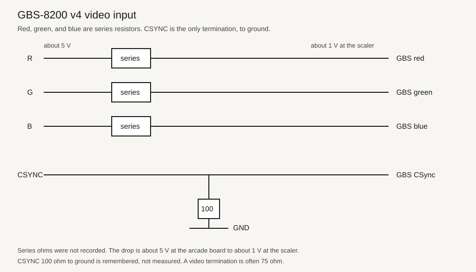
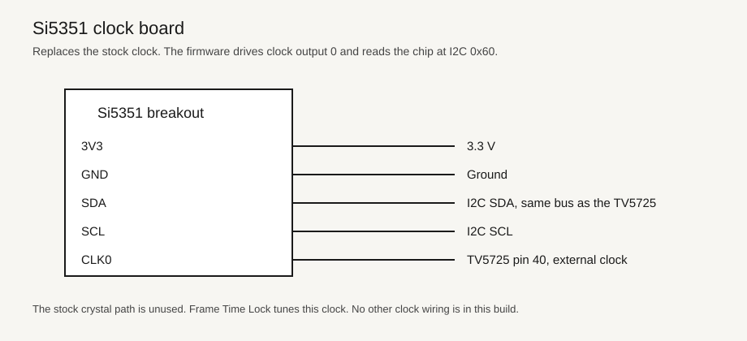
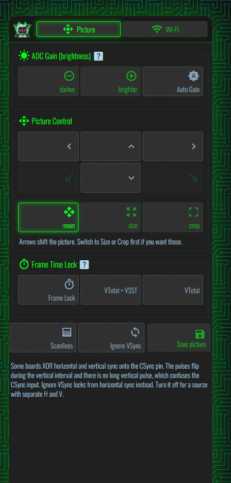
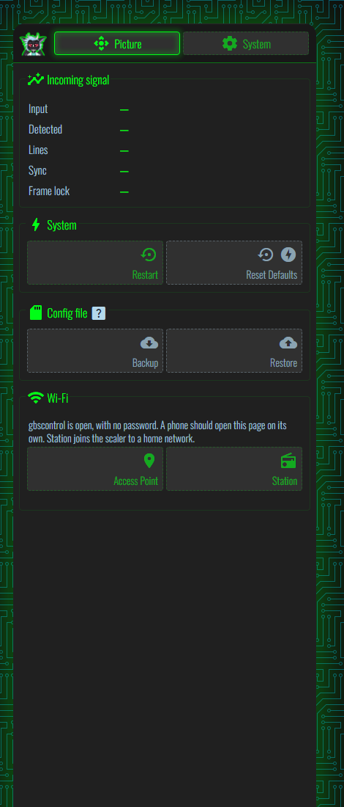
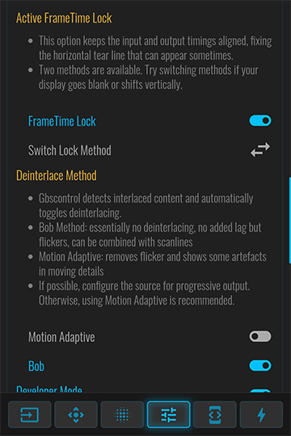
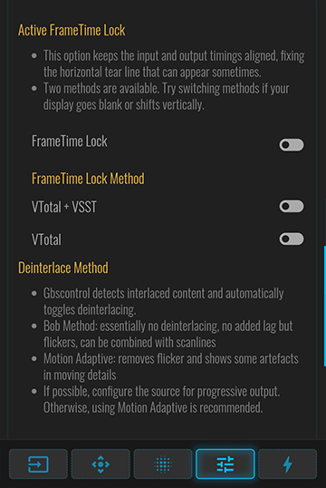
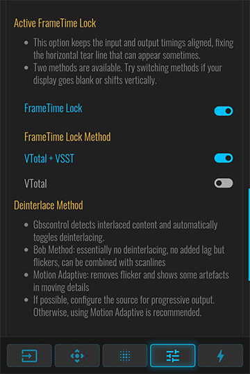
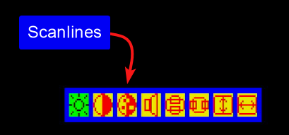

# gbs-control

A simple web page for a GBS-8200 used as a CSYNC RGB upscaler. GPL-3.0.

The hardware was built to take composite-sync RGB, the signal an arcade board puts on one sync pin, and scale it for a modern display. This spinoff keeps that job on one page. There is no OLED and no encoder. The web page is the control.

The board in use is a GBS-8200 v4. The first source is a Primal Rage arcade board. The page title is GBS-Controls.

## Hardware

Two changes on the scaler, and nothing else.

Red, green, and blue each pass through a series resistor. The ohms were not written down. The arcade video is about 5 V, and it arrives at the scaler at about 1 V. CSYNC is the only termination: about 100 ohm from that pin to ground. That 100 ohm figure is remembered, not measured. A video termination is often 75 ohm.

An Si5351 breakout replaces the stock clock. Clock output 0 goes to TV5725 pin 40. SDA and SCL share the scaler I2C bus, and the chip answers at address `0x60`. The firmware leaves that clock enabled. Frame Time Lock tunes it.

This tree starts from [cpawliuk/gbs-control-complete](https://github.com/cpawliuk/gbs-control-complete) 1.4.0. The scaler core is [ramapcsx2/gbs-control](https://github.com/ramapcsx2/gbs-control) at `e4e317a`. GitHub does not list this repository as a fork of either project. The code was committed from a snapshot, then changed for this board.

## Open the page

The open access point is `gbscontrol`, with no password. From the phone, open `http://192.168.4.1`.

On the home network the board sends the DHCP name `gbscontrol`. Open `http://gbscontrol.local` or `http://192.168.254.158` when the router has given it that address.

## Picture

- **Darker** and **brighter** move the input gain by 8. **Auto Gain** chases white on its own and turns off when you set the gain by hand.
- **Move**, **Size**, and **Crop** shift the picture, change its width and height, or slide the outer edge.
- **Frame Lock** keeps the game frame and the output frame the same length so a tear line does not crawl. **VTotal + VSST** also shifts the vertical sync. **VTotal** only changes the frame length. If the screen goes blank or jumps, use the other one.
- **Scanlines** turns the line overlay on or off.
- **Ignore VSync** is for boards that XOR horizontal and vertical sync onto the CSync pin. Those pulses flip during the vertical interval and there is no long vertical pulse, so the scaler locks from horizontal sync instead. Turn it off for a source with separate H and V.
- **Save picture** stores the size and position in one slot. That slot loads again at startup.

## Wi-Fi

**Restart** and **Reset Defaults** are on this page. **Backup** downloads `gbs-control.cfg`. **Restore** reads that file back and restarts the scaler. **Station** joins a home network. The over-the-air update button is not on the page.

The notes below are the 1.4.0 package this project started from.

# GBS-Control-Complete 1.4.0

This repository contains a modified build of [GBS-Control](https://github.com/ramapcsx2/gbs-control) along with the required libraries for building and running it on an ESP8266 using the Arduino IDE.

Precompiled builds are available by version in the `build` directory. Below, any listed changes correspond to the respective build versions.

## Included Components

- [`gbs-control`](https://github.com/ramapcsx2/gbs-control) — Original video processor firmware, modified for ESP8266.
- [`ESPAsyncWebServer`](https://github.com/me-no-dev/ESPAsyncWebServer) — Asynchronous web server library.
- [`ESPAsyncTCP`](https://github.com/me-no-dev/ESPAsyncTCP) — Async TCP library required by the web server.
- [`esp8266-oled-ssd1306`](https://github.com/ThingPulse/esp8266-oled-ssd1306) — OLED display library for ESP8266.
- [`package_esp8266com_index.json`](http://arduino.esp8266.com/stable/package_esp8266com_index.json) — Additional Boards Manager URL for ESP8266.

## Modifications and Features Added
- [`1.4.0`] Restored [Added remove presets feature - PR #496](https://github.com/ramapcsx2/gbs-control/pull/496) which was missing because the contributor edited the generated webui.html directly instead of index.html.tpl. Changes were lost on build. Initial implementation by [AlivE-git](https://github.com/AlivE-git).
- [`1.3.0`] Restored [Added color correction settings - PR #490](https://github.com/ramapcsx2/gbs-control/pull/490) which were missing because the contributor edited the generated webui.html directly instead of index.html.tpl. Changes were lost on build. Initial implementation by [AlivE-git](https://github.com/AlivE-git).
- [`1.2.0`] Improved the Web GUI in the FrameTime Lock section by replacing the single "Switch Lock Method" cycling button with explicit toggles for each method. This change makes it immediately clear which FrameTime Lock method is active, improving usability and removing the need to consult logs.

**Before:**

The active method was hidden; switching required pressing the arrow button and observing the effect.

**After:**

Each method now has its own toggle button. The currently selected method is highlighted, allowing faster and more intuitive control.

- [`1.1.0`] Added an OSD menu option to enable scanlines and adjust strength using the same intensity levels as the Web GUI.

- [`1.0.0`] Updated include paths and `#include` directives to match current IDE/library expectations.
- [`1.0.0`] Adjusted build flags and settings for ESP8266 compatibility.
- [`1.0.0`] Patched code inconsistencies in `gbs-control` that caused compiler errors.
- [`1.0.0`] Ensured all dependencies are self-contained in this repository for reproducible builds.

You can compare these changes from the original sources by checking the [commit history](https://github.com/cpawliuk/gbs-control-complete/commits/main/).

## Planned Features
- Rework of the OLED menu system.
- Add an OSD menu option for Frametime Lock with a toggle between vtotal + VSST and vtotal only methods.
- Add an OSD menu option for Deinterlace Method with a toggle between Motion Adaptive and Bob modes.

## Credits

- [rama](https://github.com/ramapcsx2) — `gbs-control`
- [me-no-dev](https://github.com/me-no-dev) — `ESPAsyncTCP` and `ESPAsyncWebServer`
- [Daniel Eichhorn](https://github.com/squix78) & [Fabrice Weinberg](https://github.com/FWeinb) — `esp8266-oled-ssd1306`
- [Christopher Pawliuk](https://github.com/cpawliuk) — Modifications and Features Added in this package

## Versions

- [`gbs-control`] — based on commit e4e317a.
- [`ESPAsyncWebServer`] — based on commit ad3741d.
- [`ESPAsyncTCP`] — as of commit 191bdeb.
- [`esp8266-oled-ssd1306`] — as of commit f90368e.